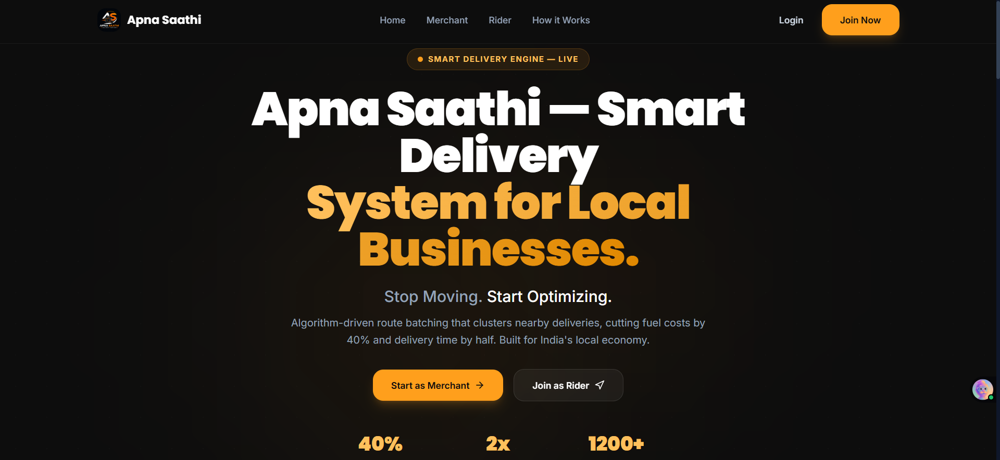
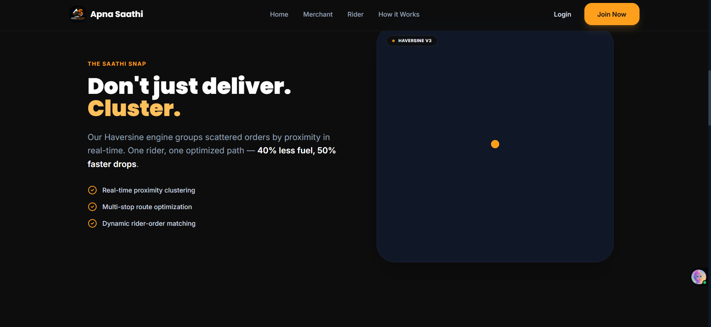
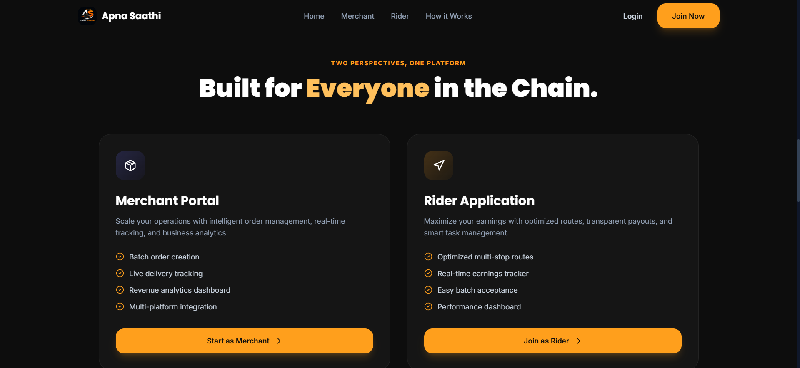
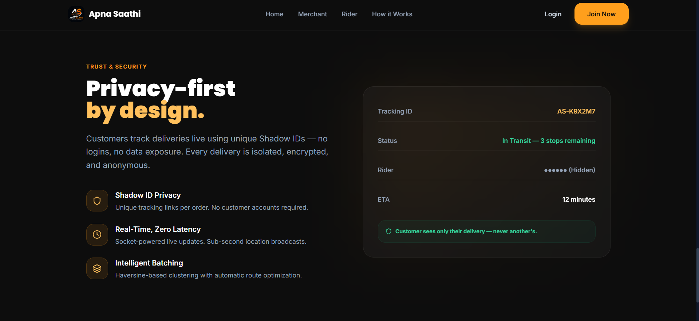

# 🏍️ Apna Saathi — Multi-Tenant Delivery Management Platform

> A production-grade, real-time delivery logistics platform built for Indian local businesses. Features multi-tenant architecture, live GPS tracking, intelligent order batching, subscription billing via Razorpay, and a privacy-first public tracking system.

---

## 📋 Table of Contents

- [Overview](#overview)
- [Architecture](#architecture)
- [Key Features](#key-features)
- [Tech Stack](#tech-stack)
- [Database Schema](#database-schema)
- [API Reference](#api-reference)
- [Real-Time System](#real-time-system)
- [Security](#security)
- [Setup & Installation](#setup--installation)
- [Project Structure](#project-structure)
- [Screenshots](#screenshots)
- [Roadmap](#roadmap)

---

## 🔍 Overview

**Apna Saathi** solves a critical pain point for local businesses in India: managing last-mile deliveries without the overhead of building their own logistics infrastructure.

The platform serves **three distinct user roles**, each with a dedicated portal:

| Role | Portal | Purpose |
|------|--------|---------|
| **Admin** | Control Tower (`/internal/control-tower`) | Full platform oversight: rider management, order routing, billing |
| **Merchant** | Merchant Dashboard (`/merchant`) | Create orders, track deliveries, manage subscriptions |
| **Rider** | Rider App (`/rider`) | Accept jobs, navigate routes, track earnings |
| **Customer** | Public Tracker (`/track/:id`) | Real-time delivery tracking via shareable link (no login required) |

### What Makes This Different?

1. **Multi-Tenancy**: Each merchant operates in complete isolation — their orders, riders, and billing data never leak to other tenants.
2. **The "Shadow ID" System**: Customers track deliveries via a unique 6-character encrypted ID (e.g., `DF-7X2A`), ensuring no sensitive business or rider data is ever exposed.
3. **The "Socket Whisperer"**: A custom Socket.io bridge that relays rider GPS coordinates to individual customer tracking rooms without exposing batch-level or rider-level metadata.

---

## 🏗️ Architecture

```
┌─────────────────────────────────────────────────────────────┐
│                        CLIENT (React + Vite)                │
│                                                             │
│   ┌──────────┐  ┌──────────────┐  ┌────────────────────┐   │
│   │ Landing  │  │   Auth Pages │  │  Role-Based Portals│   │
│   │   Page   │  │ Login/Signup │  │ Admin │ Merchant │  │   │
│   └──────────┘  └──────────────┘  │ Rider │ Public   │  │   │
│                                    └────────────────────┘   │
│   ┌─────────────────────────────────────────────────────┐   │
│   │         Context Layer (Auth + Socket + Theme)       │   │
│   └─────────────────────────────────────────────────────┘   │
└───────────────────────────┬─────────────────────────────────┘
                            │ REST API + WebSocket
┌───────────────────────────▼─────────────────────────────────┐
│                    SERVER (Express + Socket.io)              │
│                                                             │
│   ┌──────────┐  ┌──────────────┐  ┌────────────────────┐   │
│   │   Auth   │  │   Orders &   │  │    Subscription    │   │
│   │ (JWT +   │  │   Batching   │  │   (Razorpay +      │   │
│   │  Bcrypt) │  │   Engine     │  │    Webhooks)       │   │
│   └──────────┘  └──────────────┘  └────────────────────┘   │
│                                                             │
│   ┌─────────────────────────────────────────────────────┐   │
│   │          Socket Whisperer (Real-Time Bridge)        │   │
│   │  Rider Location → Batch Room → Customer Tracker     │   │
│   └─────────────────────────────────────────────────────┘   │
└───────────────────────────┬─────────────────────────────────┘
                            │
┌───────────────────────────▼─────────────────────────────────┐
│              DATABASE (MongoDB Atlas + GeoJSON)              │
│                                                             │
│   Users │ Businesses │ Orders │ Riders │ Invoices │ Payouts │
│                                                             │
│   2dsphere indexes for geospatial queries                   │
└─────────────────────────────────────────────────────────────┘
```

---

## ⚡ Key Features

### 🔐 Authentication & Authorization
- **JWT-based authentication** with secure token management
- **Bcrypt password hashing** (10 salt rounds) — passwords are never stored in plaintext
- **Role-based access control (RBAC)** with `protect` and `authorize` middleware
- **Dedicated signup flows**: Separate onboarding for merchants (`/signup/merchant`) and riders (`/signup/rider`)
- **Hidden admin route**: Admin panel lives at `/internal/control-tower` — not discoverable from the public UI

### 📦 Order Lifecycle Management
- **Full status tracking**: `pending` → `assigned` → `picked_up` → `in_transit` → `delivered`
- **Status history**: Every status change is timestamped and stored for audit trails
- **Auto-generated order numbers**: Sequential format `AS00001`, `AS00002`, etc.
- **Priority system**: Orders can be flagged as `urgent` for expedited handling
- **Weight validation**: Enforced 10kg maximum per delivery
- **Multi-platform support**: Orders can originate from `own`, `swiggy`, `zomato`, `whatsapp`, or `website`

### 🗺️ Intelligent Order Batching
- **Geospatial clustering**: Groups nearby pending orders using MongoDB's `2dsphere` indexes
- **Haversine distance calculation**: Accurate distance computation for route optimization
- **Batch assignment**: Multiple orders assigned to a single rider with sequenced delivery stops
- **Configurable batch size**: Each rider has a `maxBatchSize` (default: 4 orders)

### 📍 Real-Time GPS Tracking

#### The Socket Whisperer Architecture
```
Rider App                    Server                     Customer Browser
    │                           │                              │
    │── rider:location ────────►│                              │
    │   { riderId, lat, lng,   │                              │
    │     activeBatchId }       │                              │
    │                           │── Broadcast to Batch Room ──►│ (Merchant sees all)
    │                           │                              │
    │                           │── FOR EACH order in batch:   │
    │                           │   Find trackingId            │
    │                           │   Emit to tracking:{id} ────►│ (Customer sees ONLY
    │                           │   { lat, lng, status }       │  their delivery)
    │                           │   (No riderId exposed!)      │
    │                           │                              │
```

**Key Design Decisions:**
- Rider identity is **never** exposed to public customers
- Batch-level data stays within the batch room — customers only see coordinates
- Geo-fencing: When rider is < 500m from destination, status auto-updates to "Arriving Soon"
- ETA calculation uses average urban speed of 20 km/h

### 🔗 Shadow ID Tracking System
- Each order gets a unique **6-character alphanumeric tracking ID** (e.g., `DF-7X2A`)
- Generated using a collision-resistant algorithm with retry logic
- Characters `0`, `O`, `1`, `I`, `L` are excluded to prevent confusion
- Customers access tracking via `/track/:trackingId` — **no login required**
- The public API endpoint strips all sensitive fields and returns only:
  - Delivery status and timeline
  - Rider's first name only
  - Live GPS coordinates
  - Destination address

### 💳 Subscription & Billing Engine
- **Razorpay integration** for payment processing
- **Three subscription tiers**: Daily (₹29), Monthly (₹499), and Yearly (₹4,999)
- **Subscription gate**: Merchants without an active subscription are redirected to the pricing page
- **Webhook verification**: Razorpay webhooks are verified using HMAC-SHA256 signature validation
- **Auto-generated invoices**: Invoice numbers follow `INV0001` format with GST (18%) calculation
- **Rider payout system**: Riders can request payouts via UPI with admin approval workflow

### 🎨 Premium UI/UX
- **Dark-themed design system** with Charcoal & Saffron accent palette
- **Glassmorphism effects** with backdrop blur and frosted glass cards
- **Micro-animations** for enhanced user engagement
- **Leaflet.js maps** with custom-styled markers for riders and destinations
- **Responsive layouts** optimized for desktop and mobile
- **Live tracking indicator** with animated pulse dot

---

## 💻 Tech Stack

### Frontend
| Technology | Purpose |
|-----------|---------|
| **React 18** | Component-based UI framework |
| **Vite** | Lightning-fast build tool and dev server |
| **React Router v6** | Client-side routing with nested layouts |
| **Tailwind CSS** | Utility-first CSS framework |
| **Socket.io Client** | Real-time WebSocket communication |
| **Leaflet.js** | Interactive map rendering with OpenStreetMap tiles |
| **Lucide React** | Modern icon library |
| **Axios** | HTTP client with interceptors for auth tokens |

### Backend
| Technology | Purpose |
|-----------|---------|
| **Node.js** | JavaScript runtime |
| **Express.js** | Web framework with middleware pipeline |
| **Socket.io** | Bidirectional real-time event system |
| **MongoDB + Mongoose** | NoSQL database with schema validation |
| **JWT (jsonwebtoken)** | Stateless authentication tokens |
| **Bcrypt.js** | Password hashing and verification |
| **Razorpay SDK** | Payment gateway integration |
| **Helmet** | HTTP security headers |
| **Morgan** | Request logging |
| **CORS** | Cross-origin resource sharing |

---

## 🗄️ Database Schema

### Entity Relationship

```
User (1) ────── (1) Business     (Merchant owns a business)
User (1) ────── (1) Rider        (Rider has a user account)

Business (1) ── (N) Order        (Business creates orders)
Rider    (1) ── (N) Order        (Rider delivers orders)

Business (1) ── (N) Invoice      (Business receives invoices)
Rider    (1) ── (N) PayoutRequest (Rider requests payouts)
```

### Models

| Model | Key Fields | Indexes |
|-------|-----------|---------|
| **User** | name, email, password (hashed), role (`admin`/`business`/`rider`), businessId | email (unique) |
| **Business** | owner, name, type, address with GeoJSON, subscription (plan, isPaid, expiryDate, razorpayOrderId) | address.location (2dsphere) |
| **Order** | business, rider, pickup/drop (address + GeoJSON), status, trackingId, batchId, statusHistory[], platform, weight, category | pickup.location (2dsphere), drop.location (2dsphere), trackingId (unique, sparse) |
| **Rider** | user, name, vehicleType, currentLocation (GeoJSON), status (`offline`/`available`/`busy`), activeOrders[], earnings, rating, zone | currentLocation (2dsphere) |
| **Invoice** | business, orders[], period, subtotal, tax (18% GST), total, status, razorpayPaymentId | invoiceNumber (unique) |
| **PayoutRequest** | rider, amount, status (`pending`/`approved`/`rejected`/`processed`), upiId | — |

---

## 📡 API Reference

### Authentication
| Method | Endpoint | Description | Auth |
|--------|----------|-------------|------|
| `POST` | `/api/auth/signup` | Register merchant or rider | Public |
| `POST` | `/api/auth/login` | Login and receive JWT | Public |
| `GET` | `/api/auth/me` | Get current user profile | Protected |

### Orders
| Method | Endpoint | Description | Auth |
|--------|----------|-------------|------|
| `GET` | `/api/orders` | List orders (filtered by role) | Protected |
| `POST` | `/api/orders` | Create new order | Protected (Business) |
| `PATCH` | `/api/orders/:id/status` | Update order status | Protected |
| `POST` | `/api/orders/batch` | Auto-batch pending orders | Protected (Admin) |

### Riders
| Method | Endpoint | Description | Auth |
|--------|----------|-------------|------|
| `GET` | `/api/riders` | List all riders | Protected (Admin) |
| `PATCH` | `/api/riders/:id/status` | Update rider availability | Protected |
| `GET` | `/api/riders/nearby` | Find riders near coordinates | Protected |

### Subscription & Billing
| Method | Endpoint | Description | Auth |
|--------|----------|-------------|------|
| `POST` | `/api/subscription/create` | Create Razorpay order | Protected (Business) |
| `POST` | `/api/subscription/verify` | Verify payment signature | Protected |
| `POST` | `/api/subscription/webhook` | Razorpay webhook handler | Public (Signature verified) |
| `GET` | `/api/billing/invoices` | Get invoices for business | Protected |

### Public Tracking
| Method | Endpoint | Description | Auth |
|--------|----------|-------------|------|
| `GET` | `/api/public/track/:trackingId` | Get public tracking data | **None** |

---

## 🔌 Real-Time System

### Socket.io Events

#### Client → Server
| Event | Payload | Description |
|-------|---------|-------------|
| `joinBatch` | `batchId` | Merchant/Admin joins a batch tracking room |
| `joinAdmin` | — | Admin joins the global admin room |
| `joinTracking` | `trackingId` | Customer joins their private tracking room |
| `rider:location` | `{ riderId, lat, lng, activeBatchId }` | Rider broadcasts GPS position |
| `order:statusUpdate` | `{ orderId, status, riderId, batchId }` | Rider updates delivery status |

#### Server → Client
| Event | Payload | Description |
|-------|---------|-------------|
| `rider:locationUpdate` | `{ riderId, lat, lng, status }` | Broadcasts rider position to batch/admin rooms |
| `rider:locationUpdate` | `{ lat, lng, status }` | Privacy-filtered location to customer rooms |
| `order:statusChanged` | `{ orderId, status }` | Order status change notification |

---

## 🔒 Security

| Layer | Implementation |
|-------|---------------|
| **Passwords** | Bcrypt hashing with 10 salt rounds |
| **Authentication** | JWT tokens with configurable expiry |
| **Authorization** | Role-based middleware (`protect` + `authorize`) |
| **HTTP Headers** | Helmet.js for security headers (XSS, CSRF, etc.) |
| **Payment Webhooks** | HMAC-SHA256 signature verification |
| **Public Tracking** | Data minimization — only essential fields exposed |
| **Socket Privacy** | Customer rooms receive no rider/batch identifiers |
| **Environment** | All secrets stored in `.env` (excluded via `.gitignore`) |
| **Admin Route** | Hidden at `/internal/control-tower` — no public links |
| **Raw Body Parsing** | Webhook endpoint uses `express.raw()` before `express.json()` |

---

## 🛠️ Setup & Installation

### Prerequisites
- **Node.js** v16+
- **MongoDB Atlas** account (or local MongoDB instance)
- **Razorpay** test account (for payment features)

### 1. Clone the Repository
```bash
git clone https://github.com/HarshRajrani/Apna-Saathi-platform.git
cd Apna-Saathi-platform
```

### 2. Backend Setup
```bash
cd server
npm install
```

Create a `.env` file in the `server/` directory:
```env
PORT=5000
MONGO_URI=your_mongodb_connection_string
JWT_SECRET=your_jwt_secret_key
JWT_EXPIRE=7d
NODE_ENV=development
CLIENT_URL=http://localhost:3000
RAZORPAY_KEY_ID=your_razorpay_key_id
RAZORPAY_KEY_SECRET=your_razorpay_key_secret
RAZORPAY_WEBHOOK_SECRET=your_webhook_secret
SEED_PASSWORD=your_demo_password_here
```

Seed the database with sample data:
```bash
node seed.js
```

Start the server:
```bash
npm run dev
```

### 3. Frontend Setup
```bash
cd client
npm install
npm run dev
```

The app will be available at `http://localhost:3000`

### 4. Sample Login Credentials (After Seeding)

| Role | Email | Password |
|------|-------|----------|
| Admin | admin@apnasaathi.com | *(value of SEED_PASSWORD in .env)* |
| Merchant | rajesh@apnasaathi.com | *(value of SEED_PASSWORD in .env)* |
| Rider | suresh@apnasaathi.com | *(value of SEED_PASSWORD in .env)* |

---

## 📁 Project Structure

```
Apna-Saathi-platform/
│
├── server/                          # Backend (Express + Socket.io)
│   ├── config/
│   │   └── db.js                    # MongoDB connection logic
│   ├── middleware/
│   │   └── auth.js                  # JWT protect + role-based authorize
│   ├── models/
│   │   ├── User.js                  # User schema (bcrypt + JWT methods)
│   │   ├── Business.js              # Business schema (GeoJSON + subscription)
│   │   ├── Order.js                 # Order schema (Shadow ID + status history)
│   │   ├── Rider.js                 # Rider schema (GeoJSON + earnings)
│   │   ├── Invoice.js               # Invoice schema (GST calculation)
│   │   └── PayoutRequest.js         # Payout schema (UPI integration)
│   ├── routes/
│   │   ├── auth.js                  # Registration, login, profile
│   │   ├── orders.js                # CRUD + batching + status management
│   │   ├── riders.js                # Rider management + geospatial queries
│   │   ├── billing.js               # Invoice generation + payment tracking
│   │   ├── subscription.js          # Razorpay integration + webhooks
│   │   ├── routes.js                # Route optimization logic
│   │   ├── businesses.js            # Business profile management
│   │   └── public.js                # Unauthenticated tracking endpoint
│   ├── server.js                    # Express app + Socket.io event handlers
│   └── seed.js                      # Database population script
│
├── client/                          # Frontend (React + Vite)
│   ├── public/
│   │   └── logo.png                 # Apna Saathi brand logo
│   ├── src/
│   │   ├── api/                     # Axios instances and API helpers
│   │   ├── components/
│   │   │   ├── Layout/              # Sidebar, Topbar, PageWrapper
│   │   │   ├── ui/                  # Modal, StatsCard, StatusBadge, AddressSearch
│   │   │   └── DashboardMap.jsx     # Leaflet map with rider markers
│   │   ├── context/
│   │   │   ├── AuthContext.jsx      # JWT token management + user state
│   │   │   ├── SocketContext.jsx    # Socket.io connection provider
│   │   │   └── ThemeContext.jsx     # Dark/Light mode toggling
│   │   ├── hooks/
│   │   │   └── useRiderLocation.js  # Custom hook for live GPS updates
│   │   ├── merchant/                # Merchant-specific pages
│   │   │   ├── MerchantDashboard.jsx
│   │   │   ├── MerchantOrders.jsx
│   │   │   ├── MerchantNewOrder.jsx
│   │   │   ├── MerchantBilling.jsx
│   │   │   └── MerchantPricing.jsx
│   │   ├── rider/                   # Rider-specific pages
│   │   │   ├── JobsBoard.jsx
│   │   │   ├── ActiveRoute.jsx
│   │   │   ├── RiderProfile.jsx
│   │   │   ├── RiderEarnings.jsx
│   │   │   └── RiderLayout.jsx
│   │   ├── pages/
│   │   │   ├── LandingPage.jsx      # Public marketing page
│   │   │   ├── Login.jsx            # Role-aware login
│   │   │   ├── Signup.jsx           # Role-specific registration
│   │   │   ├── Dashboard.jsx        # Admin control tower
│   │   │   ├── Orders.jsx           # Admin order management
│   │   │   ├── Riders.jsx           # Admin rider oversight
│   │   │   ├── Batching.jsx         # Order batching interface
│   │   │   ├── Billing.jsx          # Admin billing dashboard
│   │   │   └── public/
│   │   │       └── PublicTracker.jsx # Customer tracking page
│   │   ├── utils/
│   │   │   ├── DemoUtility.js       # Quick-login demo helper
│   │   │   └── mapUtils.js          # Map helper functions
│   │   ├── App.jsx                  # Root routing with RBAC
│   │   ├── main.jsx                 # React DOM entry point
│   │   └── index.css                # Global design system (Charcoal + Saffron)
│   └── tailwind.config.js           # Custom theme tokens
│
└── .gitignore                       # Excludes .env, node_modules, build artifacts
```

---

## 🖼️ Screenshots

### 🏠 Landing Page & Hero Section

*The landing page features a sleek dark-themed design with a high-contrast Saffron accent, emphasizing the "Smart Delivery Engine" that powers the platform.*

### 📍 Haversine Proximity Clustering

*Our custom Haversine engine groups scattered orders in real-time. This clustering logic reduces fuel costs by up to 40% and speeds up delivery times by 50%.*

### 👥 Dual-Portal Architecture

*A unified platform with two distinct perspectives: The **Merchant Portal** for order creation and analytics, and the **Rider Application** for optimized multi-stop routing.*

### 🛡️ Privacy-First Shadow IDs

*Customer privacy is baked into the architecture. Using unique **Shadow IDs**, customers can track deliveries in real-time without ever seeing rider details or other orders in the batch.*

### 🏪 Merchant Portal
The Merchant Portal provides business owners with the tools to manage their entire delivery lifecycle.

#### 📊 Business Dashboard

*A high-level summary of active deliveries, revenue today, and order volume trends.*

#### 📝 Order Management

*Complete list of current and past orders with real-time status badges and tracking links.*

#### ➕ Smart Order Creation

*Intuitive form for creating new deliveries with automatic address validation and weight checks.*

#### 💳 Subscription & Pricing

*Flexible subscription plans integrated with Razorpay to keep the business running smoothly.*

#### 📄 Billing & Invoices

*Detailed financial history with automated GST invoice generation and payment status tracking.*

#### 🧾 Professional Invoicing

*Example of a system-generated invoice featuring order breakdowns, tax calculations, and business branding.*

### 💳 Subscription & Payments
The platform features a robust revenue engine powered by Razorpay, ensuring seamless monetization for the service provider.

#### 📈 Tiered Subscription Plans

*Merchants can choose from Daily, Monthly, or Yearly plans. Access to the dashboard is automatically gated based on subscription status.*

#### 🔐 Razorpay Gateway Integration

*Secure, industry-standard checkout experience with support for UPI, Cards, and Netbanking.*

#### ✅ Payment Verification & Logic

*Real-time signature verification and webhook handling ensure that subscriptions are activated instantly upon successful payment.*

### 🏍️ Rider Application
The Rider App is a mobile-optimized PWA (Progressive Web App) designed for efficiency and speed on the road.

#### 📋 Live Jobs Board

*Riders can see all available pending orders and accept batches that fit their current location and capacity.*

#### 🛣️ Active Route & Navigation

*Real-time GPS tracking with a sequenced stop list. The app automatically updates the customer when the rider is "Arriving Soon."*

#### 💰 Earnings Transparency

*A dedicated dashboard for riders to track their daily income, total deliveries, and request instant payouts via UPI.*

### 🛡️ Admin Control Tower
The Admin Panel is the "brain" of the platform, used by the service operator to manage the entire delivery ecosystem.

#### 📈 Platform Overview

*High-level metrics for the entire platform, including total revenue, active merchants, and current delivery performance.*

#### 📦 Global Order Oversight

*A master list of all orders across every merchant, allowing admins to resolve issues and monitor delivery SLAs.*

#### 🚴 Rider Management & Tracking

*Real-time status tracking for every rider on the platform, with the ability to manage earnings and performance.*

#### 🧠 Intelligent Batching Engine

*The core of the platform's efficiency: clustering pending orders into optimized batches for maximum rider productivity.*

#### 💳 Revenue & Subscription Control

*Comprehensive financial management, tracking every subscription payment and merchant invoice on the platform.*

#### 🏢 Business Onboarding

*Managing the portfolio of merchants using the platform, ensuring correct business details and geospatial zones.*

---

## 🗺️ Roadmap

- [ ] **Redis Pub/Sub Adapter** — Replace in-memory Socket.io with Redis for horizontal scaling across multiple server nodes
- [ ] **Push Notifications** — Firebase Cloud Messaging for rider alerts
- [ ] **Route Optimization** — Integration with OSRM or Google Directions API for turn-by-turn navigation
- [ ] **Analytics Dashboard** — Delivery performance metrics, heatmaps, and trend analysis
- [ ] **Multi-City Expansion** — Zone-based rider allocation across different cities
- [ ] **OTP Verification** — Delivery confirmation via one-time password
- [ ] **Rating System** — Post-delivery customer feedback for riders

---

## 👤 Author

**Harsh Rajrani**
- GitHub: [@HarshRajrani](https://github.com/HarshRajrani)

---

## 📄 License

This project is proprietary and not open for redistribution. All rights reserved.
